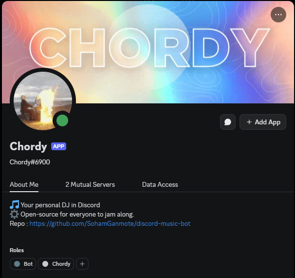

# Discord Music Bot 🎵

A simple Discord bot that can play MP3 files in voice channels. Upload your favorite music, play songs by number, and manage playback easily.

---

## Screenshot



---

## Available Commands

- 🎵 **!play [number|name]** - Play a song by its number in the list or by its filename
- ⏩ **!skip** - Skip the current song
- 🛑 **!stop** - Stop playback and disconnect the bot
- 📜 **!list** - List all available music files
- 🎶 **!queue** - Show all queued songs
---

## Setup Instructions

1. **Add your favorite music**  
   Place your MP3 files in the `music/` folder.

2. **Add your bot token**  
   Create a `.env` file in the project root and add your bot token:

   ```
   BOT_TOKEN=your_discord_bot_token_here

   ```

   💡 You can get your bot token from the [Discord Developer Portal](https://discord.com/developers/applications).

3. **Install dependencies**

   ```bash
   npm install
   ```

4. **Run the bot**

   ```bash
   npm run dev
   ```

---

## Setup Video

Watch this video for a step-by-step setup guide:
[📺 Setup Video](https://youtu.be/qJD8ldxHYh8)

---

Enjoy your music bot! 🎶


